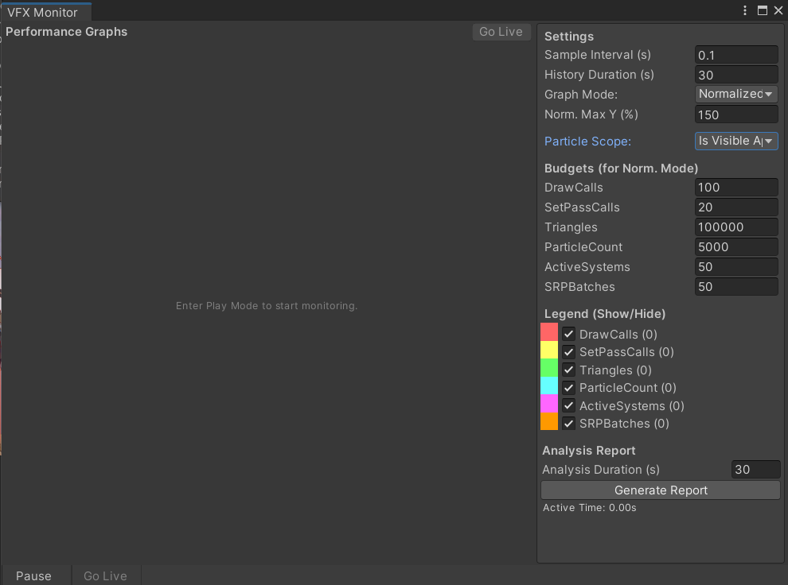

# VFX 性能监视器 (VFX Performance Monitor)

## 概述

VFX Performance Monitor 是一个为 Unity 编辑器设计的扩展工具，旨在帮助特效和开发者实时监控和分析其视觉效果在运行时的性能表现。
它提供了一个直观的界面来展示关键性能指标、识别性能瓶颈，并根据用户设定的预算提供告警和初步的优化建议。

## 主要功能

* **实时监控:** 监控 Draw Calls, SetPass Calls, Triangles, 同屏Particle Count, 同屏Particle System Count, SRP Batches。
* **粒子计数:** 基于 `Renderer.isVisible` 的统计和基于主相机视锥体的统计。
* **多种图表模式:**
    * **分离模式 (`Separate`):** 各指标独立图表，Y 轴自动适应。
    * **组合模式 (`NormalizedCombined`):** 所有可见指标在同一图表按预算归一化显示。
* **交互式图表:** 支持鼠标滚轮缩放时间轴、鼠标拖拽平移时间轴。
* **实时自动滚动与手动控制:** 默认实时滚动显示最新数据，用户交互后暂停，可通过 "Go Live" 按钮恢复。
* **悬停数据指示器:** 鼠标悬停时显示垂直指示线，并在图表旁显示该时间点的具体采样数值。
* **预算与告警:** 允许为各指标设置预算，并在超出预算时进行告警。
* **性能分析报告:** 生成基于选定时间段的文本报告，包含各指标统计数据（最新/峰值/平均/最低）、预算对比、状态评估和初步优化建议，报告文本带颜色高亮。
* **时间轴:** 显示带相对时间标签和动态间隔的坐标轴。

## 如何使用

1.  **安装:** 将以下 C# 脚本文件放入你的 Unity 项目的 `Editor` 文件夹内：
    * `VFXDataManager.cs`
    * `VFXReportGenerator.cs`
    * `VFXPerformanceMonitorWindow.cs`
2.  **打开窗口:** 在 Unity 编辑器顶部菜单选择 `Window -> Analysis -> VFX Performance Monitor`。
3.  **运行游戏:** 进入 Play Mode，监控器将自动开始采集数据。
4.  **使用界面:**
    * **主图表区:** 观察实时曲线，使用鼠标滚轮缩放，中键或 Alt+左键拖拽平移，悬停查看数值。
    * **侧边栏:**
        * **Settings 部分:**
            * 调整采样间隔 (`Sample Interval`) 和历史显示时长 (`History Duration`)。
            * 切换图表模式 (`Graph Mode`) 和粒子计数范围 (`Particle Scope`)。
            * Separate模式中，图表标题显示告警。
            * Combined模式中，图表标题下侧显示告警。
        * **Budgets 部分:**
            * 输入各项指标的性能预算值。
        * **Legend 部分:**
            * 通过复选框控制各项指标在图表中的显示/隐藏。
            * 查看各项指标的最新值。
        * **Analysis Report 部分:**
            * 使用滑块调整报告分析的时间范围。
            * 点击 "Generate Report" 按钮生成性能分析报告。
            * 在下方文本区域滚动查看报告内容（支持 Rich Text 颜色高亮）。
    * **底部栏:**
        * 点击 "Pause"/"Resume" 按钮同步编辑器暂停状态。
        * 点击 "Go Live" 按钮（当图表非自动滚动时）恢复实时视图。

## 优化方向

* 添加可交互的时间轴滑动条。
* 监控更多性能指标 (GPU 时间, 内存等)。
* 考虑使用 **UI Toolkit** 进行重构，以提升性能和 UI 体验。

